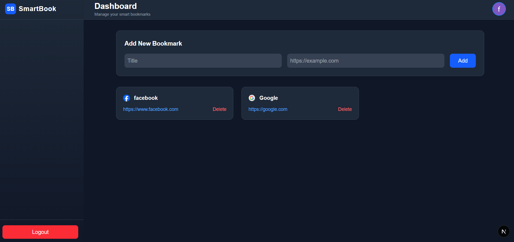

# 🚀 Smart Bookmark SaaS App

Smart Bookmark is a production-ready SaaS-style bookmark management platform built using modern full-stack technologies. It allows users to securely save, organize, and manage their important web links in a clean and responsive dashboard. The application uses Google OAuth for authentication, Supabase for backend services (database + realtime + auth), and Tailwind CSS for a modern UI experience. Designed with scalability, security, and performance in mind, this project demonstrates real-world SaaS architecture principles.

---

## ✨ Features

- 🔐 Google OAuth Authentication
- 📂 Private bookmarks per user
- ⚡ Real-time updates using Supabase Realtime
- 🌙 Dark / Light mode with persistence
- 🎨 SaaS-style UI with sidebar layout
- 🖼 Favicon auto-fetch per bookmark
- 🔔 Toast notifications
- 📱 Fully responsive design

---

## 🏗 Architecture

Frontend:
- Next.js (App Router)
- Tailwind CSS

Backend:
- Supabase (Auth + Database + Realtime)

Database:
- PostgreSQL with Row Level Security (RLS)

---

## 📁 Folder Structure

SMART-BOOKMARK-APP/
│
├── app/
│   ├── dashboard/
│   │   └── page.tsx
│   ├── login/
│   │   └── page.tsx
│   ├── layout.tsx
│   ├── page.tsx
│   └── globals.css
│
├── lib/
│   └── supabaseClient.ts
│
├── public/
│   └── screenshots/
│       └── dashboard.png
│
├── README.md
├── package.json
├── package-lock.json
├── next.config.ts
├── postcss.config.mjs
├── tsconfig.json
└── .gitignore

---

## ⚡ How Realtime Works

Supabase Realtime listens to PostgreSQL changes.

When:
- A bookmark is INSERTED
- A bookmark is DELETED

A WebSocket event is triggered.

The UI updates instantly without page refresh.

---

## 🔐 Security

- Row Level Security enabled
- Users can only access their own bookmarks
- Google OAuth only login

---

## 🚀 Deployment

Deployed on Vercel.

Environment Variables:
- NEXT_PUBLIC_SUPABASE_URL
- NEXT_PUBLIC_SUPABASE_ANON_KEY

---

## 🧠 Challenges Faced

1. Handling real-time state duplication
2. Dark mode persistence
3. Preventing double UI updates
4. Proper RLS configuration

---

## 📸 Screenshots

---

## 👨‍💻 Author

Farhan Gheri  